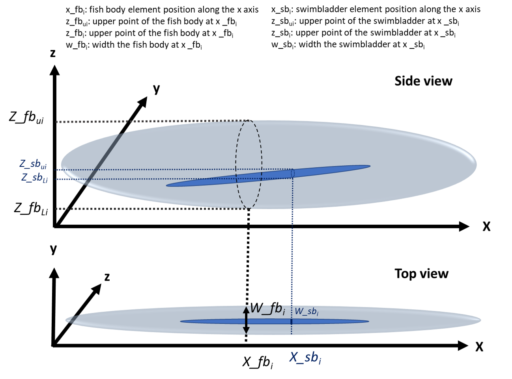

# Data included in the package

The *KRMr* package includes example shape data for sardines found on the [NOAA Southwest Fisheries Science Center webpage (SWFSC)](https://www.fisheries.noaa.gov/data-tools/krm-model). The data contains the shape descirption for the fish body `data(pil_fb)` and the swimbladder `data(pil_sb)`.  

The shape can also be plotted:  

```{r pot_sardine_shp, warning=FALSE, fig.width=8}
library(KRMr)
library(knitr)

data(pil_sb)
data(pil_fb)
par(mfrow=c(1,2))
KRMr::shplot(x_fb = pil_fb$x_fb, w_fb = pil_fb$w_fb,
            z_fbU = pil_fb$z_fbU, z_fbL = pil_fb$z_fbL,
            x_sb = pil_sb$x_sb, w_sb = pil_sb$w_sb,
            z_sbU = pil_sb$z_sbU, z_sbL = pil_sb$z_sbL)
```

More example data will be added eventually.  


# Model input parameters  

The *KRMr* implementation of the Kirchhoff Ray Mode model takes several input parameters that will define the resulting scattering. A minimal example can be used to run example simulations for sardines, with shape information found on the [NOAA Southwest Fisheries Science Center webpage (SWFSC)](https://www.fisheries.noaa.gov/data-tools/krm-model):


```{r krm_sardine example}
krm(
  frequency = 120 * 1000,
  c.w = 1490,
  rho.w = 1030,
  theta = 90,
  cs = c(1570, 345),
  rhos = c(1070, 1.24),
  shape = list(pil_fb, pil_sb),
  modes = c("fluid", "soft"),
  L = 0.21,
  fb = 1
)
```

- $frequency$ Frequency in Hz defaults to 120000  
- $c.w$ ambient soundspeed in m/s defaults to 1490  
- $rho.w$ Ambient water Density kg/m3 defaults to 1030  
- $theta$ incident angle in degrees, note that 90 degrees equals broadside incident, KRM is only stable for values   between 65 and 115 degrees, defaults 90 degrees  
- $cs$ Soundspeeds in m/s for the different body parts, defautls to c(1570, 345), typical for fish body and swimbladder  
- $rhos$ Densities in kg/m3 for the different body parts, defaults to c(1070,345) , typical for fish body and swimbladder  
- $shape$ list of shapes that describe the body parts. must contain columns that start with x,w, z (z****L,z****U), describing the position along the x axis, the width, the upper and lower height.  
- $modes$ which model mode should be used fluid or soft, fluid for weakly scattering nody parts and soft for stronger scattering parts, defaults to c("fluid", "soft"), typical for fish body and swimbladder  
- $L$ Lengths to be computed in m, defaults to 0.21  
- $fb$ Which body part is the largest, to which body part should the length be adjusted, defaults to 1 (first body part will be he largest)  

## Orientation  
°
The KRM model holds validity for orientations between 65° and 115°.  
{width=200px}  

## Shape definition

Shapes in the KRM model are scaled by the length parameter (in meters).   
{width=600px} 


Shapes are integrated over a number of elements along the shape, typically from tail to head. Each of these elements is described by $x$ the position alog the x axis, along the body from tail to head. The lower ($z_L$) and upper points ($Z_U$) at a given $x_i$, defining the height of the element, $w$ is the width of the element.  

Shapes will be combined coherently within the model. The model output will contain the complex signal from each shape and an incoherent sum can be computed ad hoc. Alternatively a coherent summation of selected parts could be computed as well.  

### Taking picture for shape extraction  

To get good shape information from pictures or XRays, it is recommended to take pictures form the side and from the top of each shape the should be included in the model.  
Here we illustrate how to take pictures for shape extraction through a few examples.  

#### Using ImageJ to extract shapes  

If you don't have ImageJ, get it from the [ImageJ webpage](https://imagej.nih.gov/ij).  
- Open the picture you want to process. 
- If the fish is not lying straight in the image (i.e. there is an angle at the head to tail line), then the image has to be aligned using *Image->Transform->Rotate*. To find the rotation angle, draw a line from the head to the tail and press *M*. This will open the Results Dialog and contain information on the angle of the line.  
- If a ruler or another size reference is visible in the picture, draw a line across the target of known length. Click *Analyze -> Set Scale* and fill out the known length. This will calibrate the pixel size in the opened image.
- Start drawing a polygon shape around the fish body or whichever part of the image you want to include in the model. Once completed, the XY information for the body part can be exported *File -> Save as.. -> XY coordinates*. 

** Using the ImageJ ROI manager**  

- It is recommended to use thee ImageJ ROI manager. Open the ROI manager by clicking: *Analyze -> Tools -> ROI Manager*. Now you can add the shape selection by clicking *Add*. It is recommended to give the shape a sensible name by clicking *Rename*.

The procedure should be repeated for all relevant body parts. Once completed, the collection of ROIS can be exported, by selecting all shapes in the ROI manager, click *More -> Save*.

Read ImageJ ROI zip file into R as list:

```{r read_imj, eval=FALSE}
library(RImageJROI)
side = RImageJROI::read.ijzip(fn) #fn should be the filename and path to the ROI.zip file
shapes = lapply(side, FUN=function(x){
  tmp=data.frame(x$coords)
  tmp$Part=x$name
  return(tmp)})
```

  
** Without ImageJ ROI Manager**  
The XY Corrdinates exported from IMageJ can be read into R with `read.table()`. A 3rd column with a shape descriptor name has to be added. THis should be something snesible like  'Dorsal_body', 'Dorsale_bladder' or 'Lateral_body','Lateral_bladder' etc.  


#### Converting IMageJ XY Coordiantes into KRM shape  

The KRMr function `Imagej2shp(shp,dorsal = c("Dorsal_body", "Dorsal_bladder"),lateral = c("Lateral_body", "Lateral_bladder"), body = 1, xy = c(1, 2), nam = 3, n = 0.01)` can be used to translate ImageJ coordinates into KRM shapes.  

- shp	dataframe containing the shape information, with at least 3 colums, contianing x,y and descriptor of shape
- dorsal names of shapes from dorsal aspect
- lateral	names of shapes from lateral aspect
- body position of the largest body in the shape names, defaults 1
- xy position of the xy coordinates in the dataframe defaults c(1,2)
- nam	position of name of the shape, defaults 3
- n Resolution of the ouput shape where 1/n elements will be returned

The resulting shape can directly be used as shape input into the `krm()` function.  

#### Example Pollock  

{width=300px}
{width=300px}  
For the XRays, the fish body side view and top shape as well as the swimbladder side view and top view shapes were extracted. They were save as XY coordinates and pasted into one csv file with a third column containing the name of the shape.  

We can read the shape information, translate it into a KRM shape and then display it in 3D:  
```{r pollock, warning=F, fig.width=12, , message=FALSE}
shp1 = KRMr::Imagej2shp(shp=read.csv("Pollock01.csv"))
KRMr::get_shp3d(shp1)

```  

Now we are ready to run a KRM simulation:

```{r pollock.krm, message=FALSE}

frequency=c(18,38,70,120,200)*1e3 #frequencies Hz
theta = seq(65,90,115) #orientations

c.w = 1490 #Ambient water m/s
rho.w = 1026.8 #density ambient water kg/m3

c.fb=1570 #soundspeed body 
c.b=345 #soundspeed swimbladder
cs = c(c.fb, c.b)

rho.fb=1070 #density body kg/m3
rho.b=1.24 #density swimbladder kg/m3
rhos = c(rho.fb, rho.b)

L = 29.7/1e2 #Lengths for pollocks in m

krm1 = krm(frequency = frequency,
      c.w = c.w,
      rho.w = rho.w,
      theta = theta,
      cs =cs,
      rhos = rhos,
      shape = shp1,
      modes = c("fluid","soft"),
      L = L[1],
      fb = 1)
knitr::kable(krm1)

```

#### Example: Herring  

{width=600px}  

Challenge: Only one top view is available for many Sideviews. Only side view of the swimbladder is avaialble.  

For herring shown here, each element of the swimbladder is condiered to be circular (diameter = width for each point along the x axis (the body length).  
For each fish, a picture should be taken sideways and from the top. The swimbladder should be clearly visible in the picture.  

Here we use these images as an example to show how to use one image providing the view from the top to multile sidevidews and how to use only the sideview of the swimbladder to generate a swimbladder where each element is assumed to be circular (note that each element can have a different radius).  

Read the available data:  

```{r HERRING_rd, message=FALSE}
fn = "HER.zip" # Path to the ImageJ ROI.zip file
top = read.table("HER_body_top.txt") # Read the only avaialble top view file

library(RImageJROI)
side = RImageJROI::read.ijzip(fn)
shapes = lapply(side, FUN=function(x){ #load all side view coordinates into a list
  tmp=data.frame(x$coords)
  tmp$Part=x$name
  return(tmp)})
```

WHat shape side views information is available?  

```{r HERRING_sav, fig.width=8, message=FALSE}
 par(mfrow=c(3,4), mar=c(1,1,1,1)) #have a quick look at the available shapes
 for(i in seq(1,length(side), by=2)){
   plot(shapes[[i]][, 1],-shapes[[i]][, 2], asp=1, type="l")
   points(shapes[[i+1]][, 1],-shapes[[i+1]][, 2], asp=1, type="l")
 }
```

Now we have to add width information to each Herring:  

```{r HERRING_add.width, message=FALSE}
####Add widths

names(top)=c("x", "y")
top$Part = "Body Top"
topr=data.frame(x=-top[,1], y=top[,2])
topr$Part = "Body Top"
shr = function(x){x$Part = "SwB Top";return(x)}
tops = list(top,shr(shapes[[2]]),  top,shr(shapes[[4]]),  top,shr(shapes[[6]]),  topr,shr(shapes[[8]]),
     topr,shr(shapes[[10]]),topr,shr(shapes[[12]]),topr,shr(shapes[[14]]),top,shr(shapes[[16]]),
     top,shr(shapes[[18]]), top,shr(shapes[[20]]), topr,shr(shapes[[22]]))

```

To add the top shape to all side views, we have to scale it correctly and then we can use the `Imagej2shp()` function:  

```{r HERRING_scale, fig.width=8, warning=FALSE, message=FALSE}
#scale top
for(i in seq(1,length(side), by=2)){
  k=(i+1)/2
  message(Sys.time(), ": Processing shape ", k)
  xmin0 = min(shapes[[i]]$x); xmax0 = max(shapes[[i]]$x)
  dx0 = xmax0-xmin0
  ymin0 = min(shapes[[i]]$y)
  shapes[[i]]$x=(shapes[[i]]$x-xmin0)/dx0
  shapes[[i]]$y=(shapes[[i]]$y-ymin0)/dx0
  shapes[[i+1]]$x = (tops[[i+1]]$x - xmin0) / dx0
  shapes[[i+1]]$y = (tops[[i+1]]$y - ymin0) / dx0

  tmin=min(tops[[i]]$x); tmax=max(tops[[i]]$x)
  ymin = min(tops[[i]]$y)
  dx= tmax-tmin
  ty=min(tops[[i+1]]$x); tmax=max(tops[[i+1]]$x)
  tops[[i]]$x = (tops[[i]]$x - tmin) / dx
  tops[[i]]$y = (tops[[i]]$y - ymin) / dx

  tops[[i+1]]$x = (tops[[i+1]]$x - xmin0) / dx0
  tops[[i+1]]$y = (tops[[i+1]]$y - ymin0) / dx0

  shp = rbind(shapes[[i]],shapes[[i+1]],tops[[i]], tops[[i+1]])

  bi=sprintf("%02d", k)
  #write.csv(shp,paste0("HER_",bi,"_shp.csv"))

  shape=Imagej2shp(shp=shp,dorsal = c("Body Top","SwB Top") ,
                   lateral = c(unique(shp$Part)[1],unique(shp$Part)[2]),
                   body=1, xy=c(1,2), nam=3, n=0.01)
    saveRDS(shape,paste0("HER_",bi,"_shape.rds"))
}
```

Once completed we can create a subplot of all generated shapes in 3D:  

```{r HERRING_sh3d, fig.height=12, fig.width=8, message=FALSE , warning=FALSE}

### Generate 3D plots

library(plotly)
library(dplyr)

p3 = lapply(1:11,FUN=function(x) {
  message(paste0("scene",x))
  get_shp3d(readRDS(paste0("HER_",sprintf("%02d", x),"_shape.rds")), scene=paste0("scene",x))
  })
fig <- subplot(p3)%>% layout(scene=list(domain=list(x=c(0,0.4),y=c(0.75,1)),
                                        aspectmode='data'))

fig <- fig %>% layout(title = "Herring Shapes",
                      scene1 = list(domain=list(x=c(0,0.4),y=c(0.75,1)),
                                   aspectmode='data'),
                      scene2 = list(domain=list(x=c(0.3,0.7),y=c(0.75,1)),
                                    aspectmode='data'),
                      scene3 = list(domain=list(x=c(0.6,1),y=c(0.75,1)),
                                    aspectmode='data'),
                      scene4 = list(domain=list(x=c(0,0.4),y=c(0.5,.75)),
                                    aspectmode='data'),
                      scene5 = list(domain=list(x=c(0.3,0.7),y=c(0.5,0.75)),
                                    aspectmode='data'),
                      scene6 = list(domain=list(x=c(0.6,1),y=c(0.5,0.75)),
                                    aspectmode='data'),
                      scene7 = list(domain=list(x=c(0,0.4),y=c(0.25,0.5)),
                                    aspectmode='data'),
                      scene8 = list(domain=list(x=c(0.3,0.7),y=c(0.25,0.5)),
                                    aspectmode='data'),
                      scene9 = list(domain=list(x=c(0.6,1),y=c(0.25,0.5)),
                                    aspectmode='data'),
                      scene10 = list(domain=list(x=c(0.3,0.7),y=c(0.,0.25)),
                                    aspectmode='data'),
                      scene11 = list(domain=list(x=c(0.6,1),y=c(0.,0.25)),
                                    aspectmode='data'))

fig
```

Now we can run a few Herring TS simulations. We wil use 1 random length for all the shapes and simulate for 38 kHz at a rotation angle of 90°:  

```{r her.sim}
set.seed(78965);L=rnorm(1,14,2.3) #random lengths drawn from a normal distribution with a mean of 14 cm and an sd of 2.3 cm

ts.all=data.frame()
for(i in 1:11){
  message(Sys.time(),": Processing Shape ", i)
  ts=krm(frequency = c(38)*1e3,
      c.w = 1490,
      rho.w = 1030,
      theta = 90,
      cs = c(1570, 345),
      rhos = c(1070, 1.24),
      shape = readRDS(paste0("HER_",sprintf("%02d", i),"_shape.rds")),
      modes = c("fluid", "soft"),
      L = L/100,
      fb = 1)
  ts$shape=i
  ts.all=rbind(ts.all,ts)
}
kable(ts.all)
```

